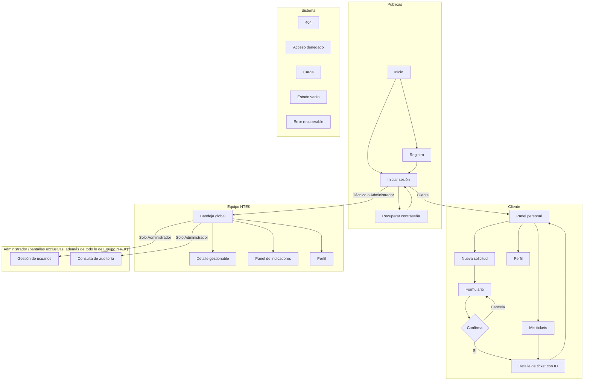

```mermaid
flowchart TD
    subgraph Publicas[Públicas]
        Inicio[Inicio] --> Login[Iniciar sesión]
        Inicio --> Registro[Registro]
        Registro --> Login
        Login --> Recuperar[Recuperar contraseña]
        Recuperar --> Login
    end

    Login -->|Cliente| Cli_Panel[Panel personal]
    Login -->|Técnico o Administrador| T_Bandeja[Bandeja global]
    T_Bandeja -->|Solo Administrador| Adm_Usuarios[Gestión de usuarios]
    T_Bandeja -->|Solo Administrador| Adm_Auditoria[Consulta de auditoría]

    subgraph Cliente[Cliente]
        Cli_Panel --> Cli_Nueva[Nueva solicitud]
        Cli_Nueva --> Cli_Formulario[Formulario]
        Cli_Formulario --> Cli_Confirma{Confirma}
        Cli_Confirma -->|Sí| Cli_Detalle[Detalle de ticket con ID]
        Cli_Confirma -->|Cancela| Cli_Formulario
        Cli_Detalle --> Cli_Panel
        Cli_Panel --> Cli_MisTickets[Mis tickets]
        Cli_MisTickets --> Cli_Detalle
        Cli_Panel --> Cli_Perfil[Perfil]
    end

    subgraph Tecnico[Equipo NTEK]
        T_Bandeja --> T_Detalle[Detalle gestionable]
        T_Bandeja --> T_Indicadores[Panel de indicadores]
        T_Bandeja --> T_Perfil[Perfil]
    end

    subgraph Administrador["Administrador (pantallas exclusivas, además de todo lo de Equipo NTEK)"]
        Adm_Usuarios
        Adm_Auditoria
    end

    subgraph Sistema[Sistema]
        Sys404[404]
        SysDenegado[Acceso denegado]
        SysCarga[Carga]
        SysVacio[Estado vacío]
        SysError[Error recuperable]
    end
```