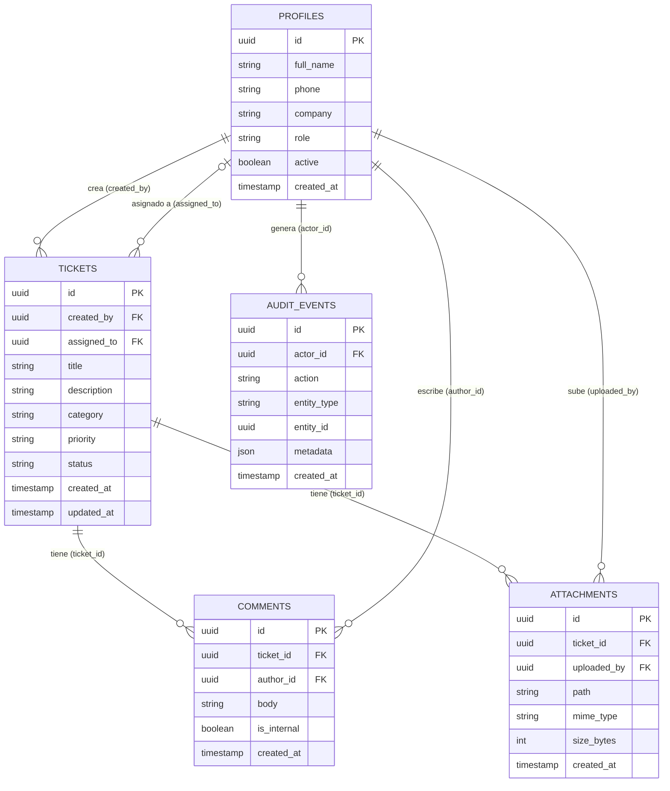

```mermaid
erDiagram
    PROFILES {
        uuid id PK
        string full_name
        string phone
        string company
        string role
        boolean active
        timestamp created_at
    }

    TICKETS {
        uuid id PK
        uuid created_by FK
        uuid assigned_to FK
        string title
        string description
        string category
        string priority
        string status
        timestamp created_at
        timestamp updated_at
    }

    COMMENTS {
        uuid id PK
        uuid ticket_id FK
        uuid author_id FK
        string body
        boolean is_internal
        timestamp created_at
    }

    ATTACHMENTS {
        uuid id PK
        uuid ticket_id FK
        uuid uploaded_by FK
        string path
        string mime_type
        int size_bytes
        timestamp created_at
    }

    %% entity_id no es una FK real: es una referencia polimorfica.
    %% La tabla a la que apunta depende del valor de entity_type (ticket, comment, attachment, etc).
    AUDIT_EVENTS {
        uuid id PK
        uuid actor_id FK
        string action
        string entity_type
        uuid entity_id
        json metadata
        timestamp created_at
    }

    PROFILES ||--o{ TICKETS : "crea (created_by)"
    PROFILES o|--o{ TICKETS : "asignado a (assigned_to)"
    TICKETS ||--o{ COMMENTS : "tiene (ticket_id)"
    PROFILES ||--o{ COMMENTS : "escribe (author_id)"
    TICKETS ||--o{ ATTACHMENTS : "tiene (ticket_id)"
    PROFILES ||--o{ ATTACHMENTS : "sube (uploaded_by)"
    PROFILES ||--o{ AUDIT_EVENTS : "genera (actor_id)"
```